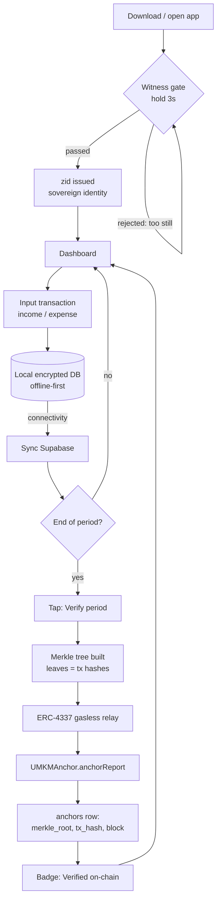
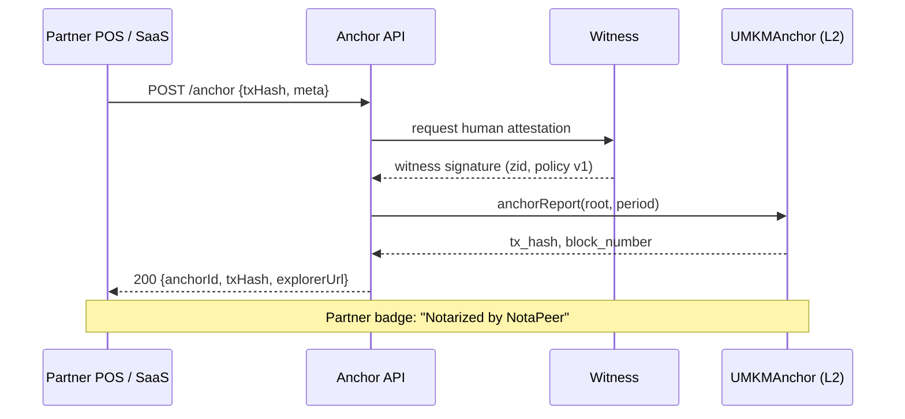
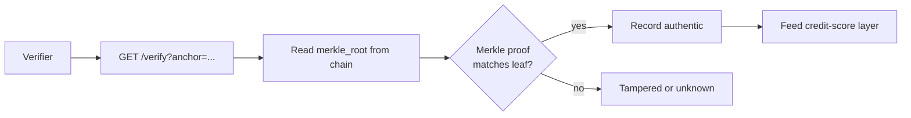

# NotaPeer — Flowcharts

Three views of the system: the merchant journey, the partner (Anchor API)
journey, and the verifier journey. Diagrams use Mermaid and render natively
on GitHub.

## 1 · Merchant Journey (core loop)



## 2 · Partner Journey (Anchor API)



## 3 · Verifier Journey (lender / auditor)



## 4 · ASCII Fallback (for tools without Mermaid)

```
[MERCHANT]
 open app -> WITNESS(hold 3s) -> zid -> dashboard
   -> input tx -> local DB -> sync -> [end of period?]
       -> merkle tree -> gasless relay -> ANCHOR(L2)
       -> badge: verified -> dashboard

[PARTNER]
 POS -> Anchor API -> Witness sig -> ANCHOR(L2) -> badge

[VERIFIER]
 lender -> read root on-chain -> merkle proof? -> authentic / tampered
```

## Design Notes

- **Gate the door, not every coin:** Witness cadence is a policy parameter
  (session budget, idle re-gate). The jam-era build gated every spin;
  production gates sessions.
- **Rules change, history does not:** anchor policy is versioned per
  attestation; old anchors stay verifiable forever.
- **Privacy by construction:** only Merkle roots cross the chain boundary.
- **Peers over oracles:** high-value records gain weight from counter-party
  witness holds, not from paid data feeds.