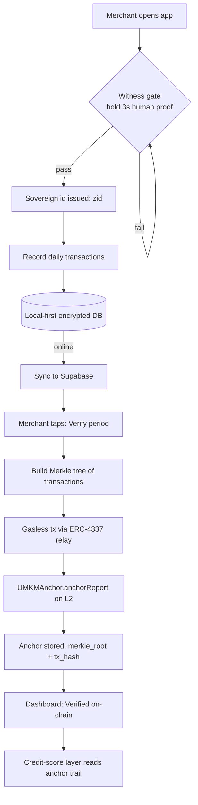

  

# NotaPeer

**Verifiable books for businesses the banks never saw.**

> Indonesian pilot brand: *UMKM Ledger* — the first deployment of NotaPeer,
> built for the 64 million micro-businesses of Indonesia.

NotaPeer turns everyday bookkeeping into **tamper-proof, on-chain evidence**:
a merchant records daily income and expenses in a private, offline-first app;
each reporting period is compressed into a Merkle root and anchored to an L2;
from that anchor trail, an **on-chain credit score** grows — readable by any
lender, verifiable by anyone, forgeable by no one.

The name says how it works: **peer**. Every book is witnessed by peers —
the human who keeps it, and the counterparties who trade with it.

---

## 🌍 The Problem

- **64 million micro-businesses in Indonesia** (and hundreds of millions
  globally) keep their books on paper or in editable spreadsheets.
- Editable books are **untrustworthy books** — banks cannot underwrite what
  can be rewritten overnight.
- Existing SaaS bookkeeping tools charge subscriptions and keep data in
  private silos; the merchant never *owns* their trust.
- Web3 alternatives demand KYC, gas money, and stable internet — luxuries
  our users do not have.

## ✨ The Solution

A cashier-simple app with three layers of trust:

| Layer | Technology | Promise |
|---|---|---|
| **1 · Identity** | ZCP2O **Witness** (on-device human proof) | A real human opens the books — no KYC, no email, no phone |
| **2 · Privacy** | Local-first encrypted DB + Supabase sync | Raw transactions never leave the merchant's control |
| **3 · Trust** | Merkle root anchored on L2 (Base / Polygon) via **Anchor API** | Only hashes go on-chain; history becomes immutable |

**"Hold to witness."** — three seconds of human presence seal every identity
and every report. Bots do not tremble; humans do.

## 🔄 How It Works

Full diagrams (partner flow, verification flow) live in
[`docs/FLOWCHART.md`](docs/FLOWCHART.md).

## 🧩 Components

- **Witness** — on-device proof-of-human gate (micro-jitter sampling;
  perfectly still holds are rejected). Session-scoped: one hold opens a
  proof budget; cadence is a policy parameter, not a hard rule.
- **Anchor API** — one call for partners: `POST /anchor {txHash, meta}` →
  hash anchored on-chain with witness attestation. Existing POS and
  bookkeeping apps become NotaPeer-notarized without rebuilding anything.
- **UMKMAnchor (Solidity ^0.8.20)** — the notary contract:
  `anchorReport(merkleRoot, periodStart, periodEnd)`,
  `verifyTransaction(periodKey, leaf, proof)`,
  events `ReportAnchored` / `ReportRevoked`.
- **Credit Score Layer** *(roadmap)* — reads anchor trails + consistency
  signals; exposes a public, permissionless score for DeFi lenders.

##  The Peer Layer *(differentiator)*

Trust is not only cryptographic — it is **social**. Large transactions
(> Rp 1,000,000) can carry a **counter-party witness**: the supplier or
customer confirms the record with their own Witness hold. Peer-attested
records carry higher weight in the credit-score layer.

## 🏛️ Why Not Just Use Existing SaaS?

| | Traditional SaaS | NotaPeer |
|---|---|---|
| Data custody | Vendor silo | Merchant-owned, hash-anchored |
| Trust mechanism | Brand + legal | Cryptographic + peer witness |
| Identity | Email / phone / KYC | Witness (sovereign, offline-capable) |
| Cost to merchant | Subscription | Free core, forever |
| Path to capital | None | On-chain credit score |

NotaPeer does not fight incumbents — the **Anchor API** is designed to be
*adopted by them*.

## 🗺️ Status & Roadmap

- [x] **Phase 0 — Doctrine:** README, flowcharts, whitepaper (in progress)
- [ ] **Phase 1 — MVP:** Witness onboarding · transaction ledger · monthly anchor (Base Sepolia)
- [ ] **Phase 2 — Pilot:** 10–100 real merchants, one city
- [ ] **Phase 3 — Partners:** first Anchor API integration + first grant
- [ ] **Phase 4 — Credit:** score layer live · first DeFi lending read

## 📚 Docs

- [`docs/FLOWCHART.md`](docs/FLOWCHART.md) — merchant, partner, and verifier flows
- [`docs/GLOSSARY.md`](docs/GLOSSARY.md) — plain-language dictionary (Merkle, ERC-4337, Witness…)
- [Whitepaper](docs/WHITEPAPER.md) — vision, architecture, business model
- ZCP2O Protocol (identity layer): <https://github.com/Ringga999/zcp2o-protocol>

## ⚓ Genesis Anchor

On **23 September 2026**, the first NotaPeer books were anchored on-chain.
Two warung transactions — a coffee sale and a rice purchase — were folded
into a Merkle root and notarized on the Sepolia testnet.

| Artifact | Value |
|---|---|
| Network | Sepolia (testnet) |
| Contract | [`0xd98b…F64Bb`](https://sepolia.etherscan.io/address/0xd98bC541D2eb837b40e291fa8cff45e35E5F64Bb) |
| Anchor tx | [`0x6f6a…0d38`](https://sepolia.etherscan.io/tx/0x6f6a9e9bdb8d90eb5a3dff0a10c5b106e66e0e7708e25f82175913ef8d0f0d38) |
| Merkle root | `0x17006746c2899f1d6fcac1bca2563058a410bd24541972a806834bdde1f5b58a` |
| Anchored by | `0x6C2C…2ED6d` |

*From a warung notebook to an immutable ledger — verifiable by anyone,
forgeable by no one.*

## ⚖️ License

MIT — see [LICENSE](LICENSE).

---

*Built by a solo founder with Rp 0 capital, in public.
Questions, critiques, partnerships: open an issue.*